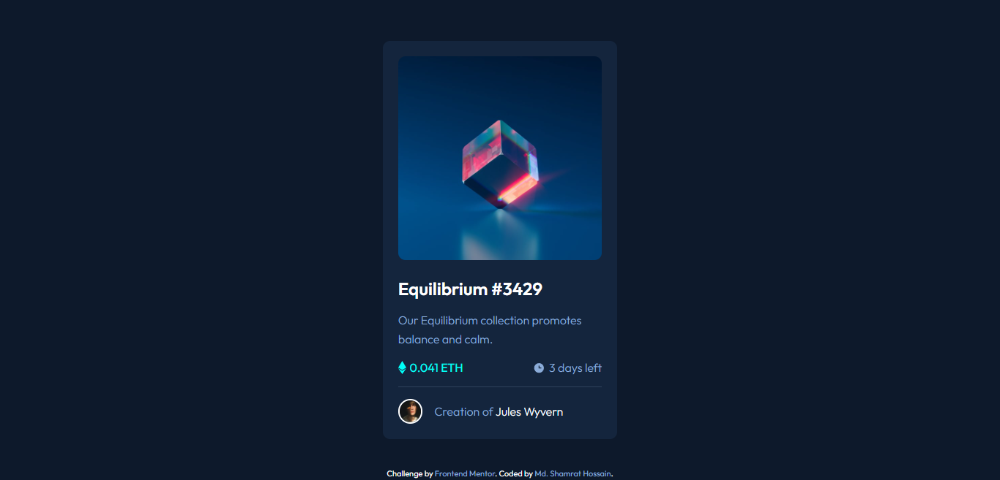

# NFT Card Preview 

This is a solution to the [NFT preview card component challenge on Frontend Mentor](https://www.frontendmentor.io/challenges/nft-preview-card-component-SbdUL_w0U). 

## Table of contents

- [Overview](#overview)
  - [Screenshot](#screenshot)
  - [Links](#links)
- [My process](#my-process)
  - [Built with](#built-with)
- [Author](#author)

## Overview

Simple one page project. I used CSS common properties, variable and flexbox. 

### Screenshot

### Links

- Solution URL: [Code Link](https://github.com/shamratPG/nft-card-preview.git)
- Live Site URL: [Live Site](https://shamratpg.github.io/nft-card-preview/)

### Built with

- Semantic HTML5 markup
- CSS custom properties
- Flexbox

## Author

- Website - [Md. Shamrat Hossain](https://github.com/shamratPG)
- Twitter - [@shamratpg](https://twitter.com/shamratpg)
- Frontend Mentor - [@shamratPG](https://www.frontendmentor.io/profile/shamratPG)
